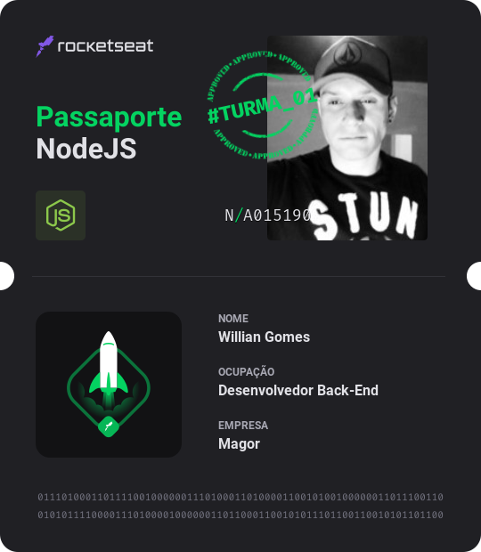

<h1 align="center">
    Trilha de node.js
</h1>  

## ✨ Exercícios

### Exercícios do novo curso da rocketseat 🚀  Ignite
- ### 💻 [Node.js](https://nodejs.org)
  Chapter I
    - 01-concepts
    - 02-middlewares
    - 03-validations

  Chapter II
    - 01-typscript
    - 02-API
    - 03-S.O.L.I.D
    - 04-refactoring
    - 05-upload
    - 06-documentation

## ✨ Passaporte

  

## 📄 Licença

Esse projeto está sob a licença MIT.